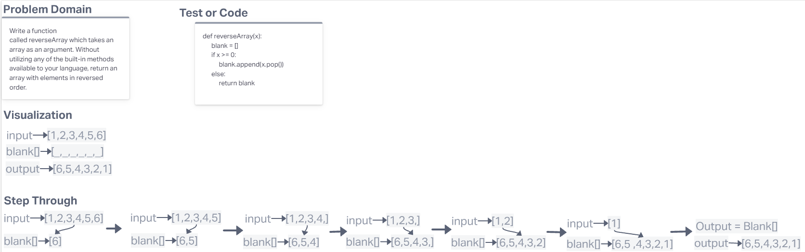

# Reverse an Array
You have to reverse an array without using prebuilt functions.

## Whiteboard Process

## Approach & Efficiency
I figured a pop and append would be the fastest and easiest way to achieve this. I think my whiteboard skills is crap but o well.
